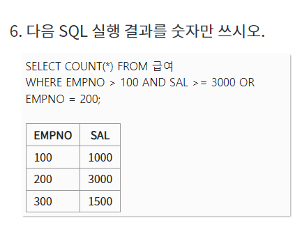
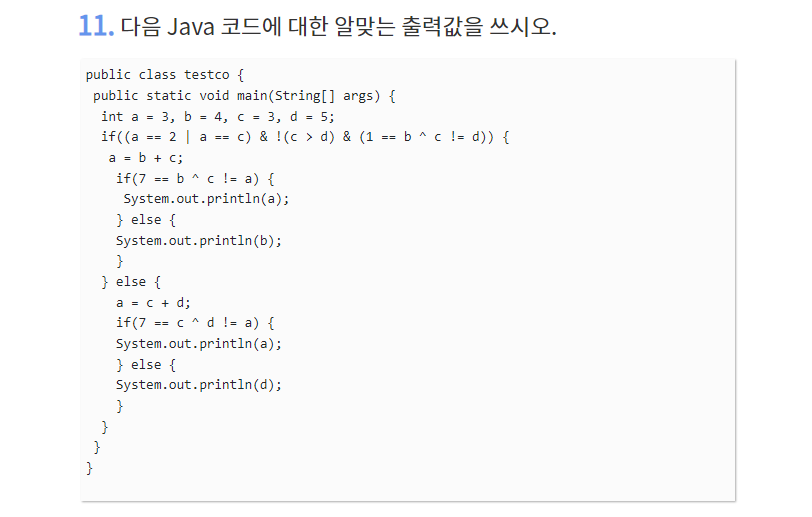

## 6, 7단원 - 프로그래밍 언어 및 SQL

 

<details><summary>답</summary><div markdown="1"> 
    A: '이%''
    B: 이름 DESC
    </div></details>

```
a: '이%'
b: 이름 desc;
```




<details><summary>답</summary><div markdown="1"> 
    1
    </div></details>

```
1
```


<details><summary>답</summary><div markdown="1"> 4 </div></details>

<details> <summary>해설</summary> <div markdown="1"> 크로스조인을 하게 되면 데이터의 개수가 카티션 곱이 되어 3x2 = 6개가 된다. 그중에서 where조건에 걸리는 allen 두 행을 제외한 4개가 답이 된다. </div> </details>

```
```


<details><summary>답</summary><div markdown="1"> 1024 </div></details>

<details> <summary>해설</summary> <div markdown="1"> base=2, exp=10 / 
    i=0 1*2 = 2
    i=1 2*2 = 4
    i=2 4*2 = 8
    ...
    i=9 512*2 = 1024</div> </details>

```
```


<details><summary>답</summary><div markdown="1"> 
KOREA
EA
K
E
M </div></details>

<details> <summary>해설</summary> <div markdown="1"> %s: 여러개 출력 / %c: 한개 출력 / *p+2는 주소 입력이 아니라 단순 숫자 더하기이므로 아스키코드상 K+2, 즉 M이 출력된다. </div> </details>

```
KOREA
EA
K
E
M
```




<details><summary>답</summary><div markdown="1"> 7 </div></details>

```
7
```

